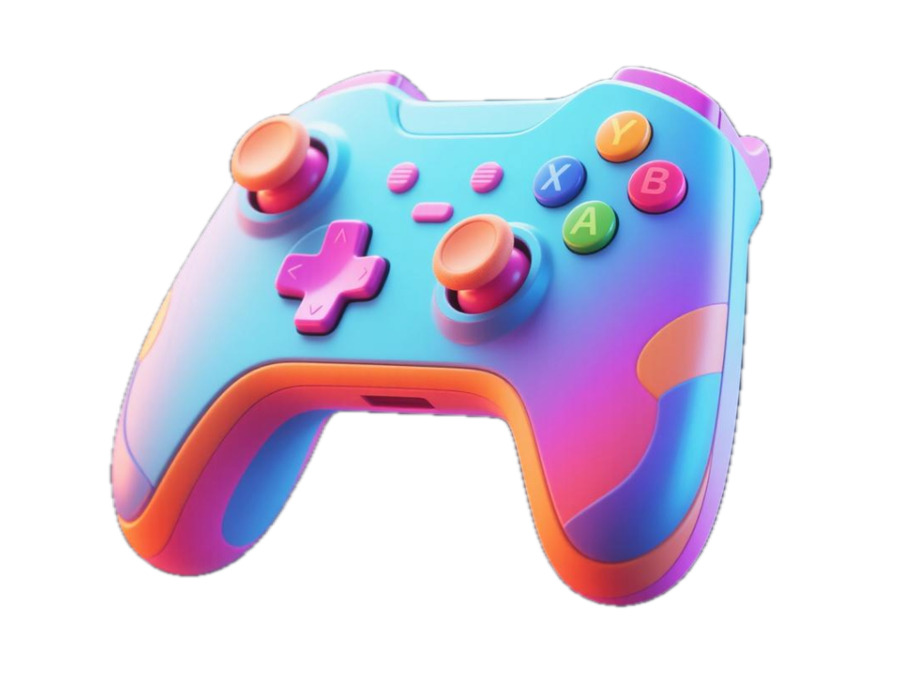

# EpicVibe

<p align="center">
  
</p>

<p align="center">
  <a href="https://www.epicvibe.fun" target="_blank">Website</a> |
  <a href="https://x.com/EpicVibeSOL" target="_blank">Twitter</a>
</p>

## Vision

EpicVibe aims to ignite global creators' sparks of inspiration through an AI-driven game creation editor, empowering non-technical users to craft playable Solana blockchain games using natural language. We're building a decentralized creative empowerment platform that breaks down technical barriers, enabling students, artists, and trendsetters to become game creators.

## Project Overview

EpicVibe is a Web3 creator platform on the Solana blockchain, centered around an AI-driven game creation editor that enables non-technical users to generate playable 2D or 3D chain games via natural language descriptions. These games are directly converted into Solana chain games through EpicVibe's creator platform, playable via browsers and shareable within the community.

## Core Features

- **AI-Driven Creation**: Generate chain games via natural language with AI handling code, art, and mechanics
- **Decentralized Creative Ecosystem**: Seamless conversion to Solana chain games
- **$EPIC Token Incentives**: Rewards for creators and players based on participation
- **Real-Time Community Collaboration**: Full-channel chat for creator-player interaction
- **Solana Technical Superiority**: High throughput and low fees for optimal performance

## Component Structure

The client application is built with a modular component structure:

- **AppLayout**: Main layout wrapper that includes Header and Footer components
- **HomePage**: Main entry point that combines all sections
- **Header**: Navigation bar with branding and main menu
- **Hero**: Eye-catching hero section with main value proposition and call-to-action
- **Features**: Highlights of key platform capabilities
- **Testimonials**: User testimonials showcasing platform benefits
- **Footer**: Site footer with links to resources and social media

### CSS Organization

Each component has its dedicated CSS file for easy maintenance:

- **global.css**: Base styles, variables, and utility classes
- **header.css**: Header component styling
- **hero.css**: Hero section styling with gradient effects
- **features.css**: Styling for feature cards and grid layout
- **testimonials.css**: Styling for testimonial cards and layout
- **footer.css**: Footer styling and responsive adjustments
- **button.css**: Reusable button component styling

### Utility Components and Helpers

- **Button.jsx**: Reusable button component with various styles and sizes
- **api.js**: Functions for API communication
- **helpers.js**: Common utility functions for date formatting, text manipulation, etc.

## System Architecture

```
┌─────────────────────┐     ┌─────────────────────┐     ┌─────────────────────┐
│                     │     │                     │     │                     │
│   AI Game Editor    │────▶│   Game Converter    │────▶│   Solana Chain      │
│   (Natural Language)│     │   (Code Generation) │     │   (Deployment)      │
│                     │     │                     │     │                     │
└─────────────────────┘     └─────────────────────┘     └─────────────────────┘
          │                           │                           │
          │                           │                           │
          ▼                           ▼                           ▼
┌─────────────────────┐     ┌─────────────────────┐     ┌─────────────────────┐
│                     │     │                     │     │                     │
│   Asset Generation  │     │   Community Hub     │     │   Token Economy     │
│   (AI-driven)       │     │   (Sharing/Feedback)│     │   ($EPIC Rewards)   │
│                     │     │                     │     │                     │
└─────────────────────┘     └─────────────────────┘     └─────────────────────┘
```

## Game Creation Flow

1. **Input**: User provides natural language description (e.g., "a cyberpunk racing game with hoverbikes")
2. **AI Processing**: System generates game framework, characters, maps, mechanics, and artwork
3. **Customization**: User refines details through additional prompts or interface controls
4. **Deployment**: Game is converted to Solana chain game and made playable in browser
5. **Community**: Players access, play, and provide feedback
6. **Rewards**: Creators earn $EPIC tokens based on game popularity and engagement

## Technical Stack

- **Frontend**: React/Next.js with modern UI components
- **AI Engine**: NLP and generative models for game creation
- **Blockchain**: Solana for high throughput and low transaction fees
- **Smart Contracts**: Anchor Framework for token distribution and governance
- **Storage**: Arweave for decentralized game data storage

## Styling Approach

- **Modern UI**: Vibrant gradients and smooth animations
- **Responsive Design**: Fully responsive layout that works on all devices
- **Dark Mode Support**: Support for light and dark themes
- **Consistent Component Design**: Unified styling system with CSS variables
- **Accessibility**: Accessible color contrast and semantic HTML structure

## Design System

The project uses a consistent design system with the following elements:

- **Colors**: Primary gradient from #ff2e63 to #ff9a8b, dark backgrounds (#1a1a2e, #16213e)
- **Typography**: Modern sans-serif stack with variable font weights
- **Spacing**: Consistent spacing system using CSS variables
- **Components**: Reusable components for buttons, cards, and layout elements

## Getting Started

### Prerequisites

- Node.js (v14+)
- npm or yarn
- Solana CLI tools (for blockchain interaction)

### Installation

```bash
# Clone the repository
git clone https://github.com/yourusername/epicvibe.git
cd epicvibe

# Install dependencies
npm install

# Start development server
npm run dev
```

## Community and Social Features

- Real-time chat for creators and players
- Creation challenges with rewards
- Referral program for community growth
- On-chain governance for platform decisions
- Social sharing with attribution tracking

## Contributing

We welcome contributions from the community! Please check our contribution guidelines before submitting pull requests.

## License

This project is licensed under the MIT License - see the LICENSE file for details.

## Contact

For any inquiries, please reach out to us:

- Website: [epicvibe.fun](https://www.epicvibe.fun)
- Twitter: [@EpicVibeSOL](https://x.com/EpicVibeSOL)
